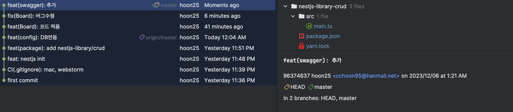
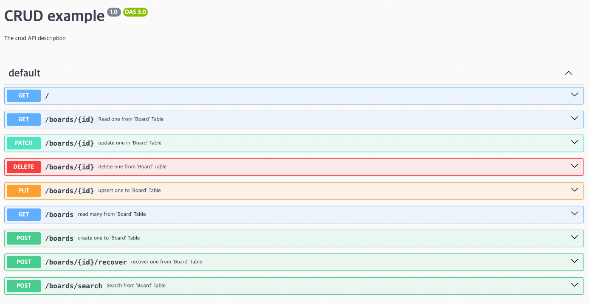

# nestjs-library-crud

## 목표
우아한형제의 NestJS CRUD를 자동생성해주는 라이브러리는 개발시간이 얼마나 단축시켜줄까?
https://github.com/woowabros/nestjs-library-crud

### 개발내용
- 게시판 CRUD

### 시간 체크
- 총 시간 (약 2시간)

- 세부 시간
  - 초기 환경설정 30분
    - first commit ~ feat(config): DB연동
    - Yesterday 11:36 PM ~ Today 12:04 AM 
  - 코드 입력시간 10분
  - 버그 수정 1시간 20분 
    - fix(Board): 버그수정
      - README 예제 틀린 이슈
- 결과물
    

### 소감
- 버그 찾으면서 `getMetadataArgsStorage()`를 사용해서 테이블의 메타정보를 가져오고 처리하는걸 알 수 있었음
- 실제 코드 작성시간은 10분정도.! 빠르다
